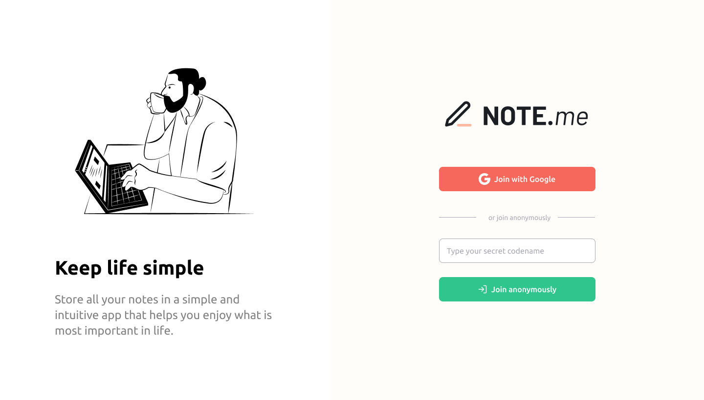

<h1 align="center">
  Notes.me
</h1>

<p align="center">
  
  
  
  
  

  <a href="https://github.com/humbruno/notes/commits/master">
    
  </a>
  
  <a href="https://github.com/humbruno/notes/issues">
    
  </a>
</p>

<p align="center">
  
</p>

## 💻 Project

Notes.me is a full-stack project that uses Firebase to store data, where the user can sign-in using a Google Account or anonymously and easily add, delete and update notes.

Technologies used for this project:

- [Nextjs](https://nextjs.org/)
- [TypeScript](https://redux-toolkit.js.org/)
- [Styled Components](https://styled-components.com/)
- [Firebase Auth & Firestore Database](https://firebase.google.com/)
- [React Toastify](https://github.com/fkhadra/react-toastify#readme)

## 🔌 Live Website Link

- [Live Website](https://notes.brunosantos.dev/)

## 📥 Installing and executing

Clone this repository and access the directory.

Add a `.env.local` file and replace the following environment variables with your Firebase configuration:

```
NEXT_PUBLIC_FIREBASE_API_KEY=
NEXT_PUBLIC_FIREBASE_AUTH_DOMAIN=
NEXT_PUBLIC_FIREBASE_PROJECT_ID=
NEXT_PUBLIC_FIREBASE_STORAGE_BUCKET=
NEXT_PUBLIC_FIREBASE_MESSAGING_SENDER_ID=
NEXT_PUBLIC_FIREBASE_APP_ID=
```

```bash
# Instaling dependencies
$ npm install

# Executing the application
$ npm run dev
```
